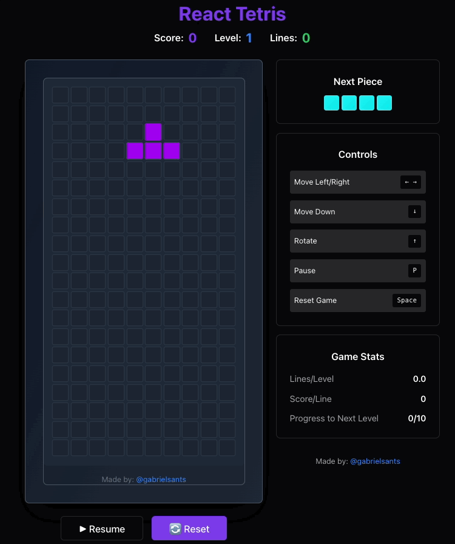

# 🎮 React Tetris

Um jogo Tetris moderno e responsivo construído com React, TypeScript e Tailwind CSS.



## ✨ **Características**

- 🎯 **Gameplay Clássico**: Tetris tradicional com mecânicas modernas
- 📱 **Totalmente Responsivo**: Funciona perfeitamente em desktop e mobile
- 🎨 **Interface Moderna**: Design limpo com Framer Motion e Tailwind CSS
- 🎵 **Sistema de Áudio**: Efeitos sonoros e música de fundo
- 🏆 **Sistema de High Scores**: Ranking de pontuações com persistência
- 🎮 **Controles Touch**: Controles específicos para dispositivos móveis
- ⚙️ **Configurações**: Controle de volume e outras opções
- 🌙 **Tema Escuro**: Suporte a tema escuro/claro
- 🚀 **Performance Otimizada**: Memoização e hooks customizados

## 🛠️ **Tecnologias Utilizadas**

### Frontend
- **React 18** - Biblioteca de interface
- **TypeScript** - Tipagem estática
- **Tailwind CSS** - Framework CSS utilitário
- **Framer Motion** - Animações e transições

### Backend
- **Express.js** - Servidor Node.js
- **Drizzle ORM** - ORM para banco de dados
- **PostgreSQL** - Banco de dados principal
- **WebSockets** - Comunicação em tempo real

### Ferramentas
- **Vite** - Build tool e dev server
- **ESBuild** - Bundler para produção
- **React Query** - Gerenciamento de estado do servidor

## 🚀 **Como Executar**

### Pré-requisitos
- Node.js 18+ 
- npm ou yarn
- PostgreSQL (opcional para desenvolvimento)

### Instalação

1. **Clone o repositório**
```bash
git clone https://github.com/gabrielsants/react-tetris.git
cd react-tetris
```

2. **Instale as dependências**
```bash
npm install
```

3. **Execute o projeto**
```bash
# Desenvolvimento
npm run dev

# Build para produção
npm run build

# Iniciar produção
npm start
```

O jogo estará disponível em `http://localhost:5001`

## 🎮 **Como Jogar**

### Controles Desktop
- **Setas Esquerda/Direita**: Mover peça
- **Seta Baixo**: Queda rápida
- **Seta Cima**: Rotacionar peça
- **P**: Pausar/Resumir
- **Espaço**: Resetar o game
- **ESC**: Fechar modais ou voltar

### Controles Mobile
- **Botões Touch**: Controles específicos na parte inferior da tela
- **Gestos**: Suporte a gestos touch

### Objetivo
- Organize as peças para formar linhas completas
- Cada linha limpa aumenta sua pontuação
- O jogo acelera conforme você avança de nível
- Tente conseguir o maior score possível!

## 🏗️ **Estrutura do Projeto**

```
react-tetris/
├── client/                 # Frontend React
│   ├── src/
│   │   ├── components/     # Componentes React
│   │   ├── hooks/         # Hooks customizados
│   │   ├── lib/           # Utilitários e lógica
│   │   ├── pages/         # Páginas da aplicação
│   │   └── main.tsx       # Entry point
│   ├── index.html
│   └── package.json
├── server/                 # Backend Express
│   ├── index.ts           # Servidor principal
│   ├── routes.ts          # Rotas da API
│   └── storage.ts         # Gerenciamento de dados
├── shared/                 # Código compartilhado
│   └── schema.ts          # Esquemas de banco
└── docs/                   # Documentação
```

## 🔧 **Funcionalidades Principais**

### Sistema de Jogo
- ✅ Geração aleatória de peças
- ✅ Sistema de colisão
- ✅ Limpeza de linhas
- ✅ Sistema de pontuação
- ✅ Aumento progressivo de dificuldade
- ✅ Detecção de game over

### Sistema de Áudio
- ✅ Efeitos sonoros para ações
- ✅ Controle de volume
- ✅ Música de fundo opcional
- ✅ Suporte a vibração (mobile)

### Sistema de High Scores
- ✅ Persistência de pontuações
- ✅ Ranking ordenado
- ✅ Validação de dados
- ✅ Interface para envio de scores

### Controles e UX
- ✅ Controles responsivos
- ✅ Suporte a teclado e touch
- ✅ Sistema de pausa
- ✅ Modais informativos
- ✅ Animações suaves

## 🚀 **Deployment**

### Produção
```bash
npm run build
npm start
```

### Docker (opcional)
```bash
docker build -t react-tetris .
docker run -p 5001:5001 react-tetris
```

## 🤝 **Contribuindo**

1. Fork o projeto
2. Crie uma branch para sua feature (`git checkout -b feature/AmazingFeature`)
3. Commit suas mudanças (`git commit -m 'Add some AmazingFeature'`)
4. Push para a branch (`git push origin feature/AmazingFeature`)
5. Abra um Pull Request

## 📄 **Licença**

Este projeto está sob a licença MIT. Veja o arquivo [LICENSE](LICENSE) para mais detalhes.

## Contributors

<a href="https://github.com/gabrielsants/react-tetris/graphs/contributors">
  
</a>

---

⭐ **Se este projeto te ajudou, considere dar uma estrela!**